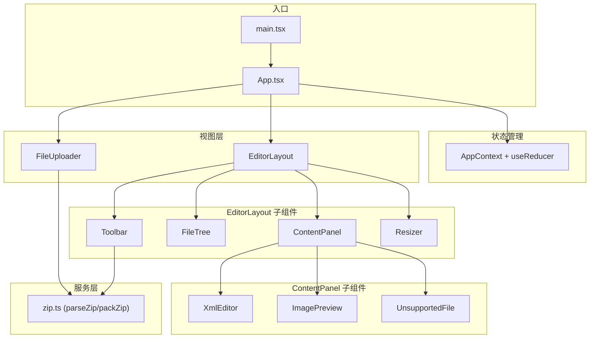

# OOXML Editor 架构文档

## 概述

本项目是一个纯前端静态应用，用于预览和编辑 OOXML 文件（.docx, .xlsx, .pptx）的内部结构。

## 技术栈

| 类别 | 选择 | 说明 |
|------|------|------|
| 构建工具 | Vite | 快速的开发服务器和构建 |
| 语言 | TypeScript | 类型安全 |
| 框架 | React 18 | 组件化开发，状态管理 |
| 样式 | Tailwind CSS | 原子化 CSS，快速开发 |
| 编辑器 | CodeMirror 6 | 轻量、支持 XML 语法高亮和代码折叠 |
| ZIP 处理 | JSZip | 纯前端解压/压缩 ZIP 文件 |
| 字体 | Source Code Pro | 代码编辑器字体（自托管 woff2） |

## 核心依赖

```json
{
  "dependencies": {
    "react": "^18.2.0",
    "react-dom": "^18.2.0",
    "jszip": "^3.10.1",
    "codemirror": "^6.0.1",
    "@codemirror/lang-xml": "^6.1.0",
    "@codemirror/language": "^6.10.0"
  },
  "devDependencies": {
    "typescript": "^5.0.0",
    "vite": "^5.0.0",
    "@vitejs/plugin-react": "^4.0.0",
    "@types/react": "^18.2.0",
    "@types/react-dom": "^18.2.0",
    "tailwindcss": "^3.4.0",
    "postcss": "^8.4.0",
    "autoprefixer": "^10.4.0"
  }
}
```

## 模块总览



---

## 核心数据结构

### 节点类型

```typescript
// 基础节点
interface BaseNode {
  name: string;           // 节点名称，如 "document.xml"
  path: string;           // 完整路径，如 "word/document.xml"
}

// 文件节点
interface FileNode extends BaseNode {
  type: 'file';
  content: string | Uint8Array;  // 文本内容或二进制内容
}

// 目录节点
interface DirNode extends BaseNode {
  type: 'dir';
  children: TreeNode[];   // 子节点
}

// 联合类型
type TreeNode = FileNode | DirNode;
```

### 应用状态

```typescript
interface AppState {
  fileName: string | null;        // 当前打开的文件名
  tree: TreeNode[] | null;        // 目录树（根级节点数组）
  expandedPaths: Set<string>;     // 展开的目录路径集合
  selectedPath: string | null;    // 当前选中的文件路径
}
```

---

## 模块详细设计

### 1. 状态管理（React Context + useReducer）

使用 React Context 管理全局状态，组件通过 hooks 访问和修改状态。

```typescript
// Actions
type Action =
  | { type: 'LOAD_ZIP'; fileName: string; tree: TreeNode[] }
  | { type: 'SELECT_FILE'; path: string }
  | { type: 'TOGGLE_EXPAND'; path: string }
  | { type: 'UPDATE_CONTENT'; path: string; content: string }
  | { type: 'RESET' };

// Reducer
function reducer(state: AppState, action: Action): AppState;

// Context
const AppContext = React.createContext<{
  state: AppState;
  dispatch: React.Dispatch<Action>;
} | null>(null);

// Hook
function useAppState(): { state: AppState; dispatch: React.Dispatch<Action> };
```

### 2. ZipService（ZIP 处理服务）

纯函数式服务，封装 JSZip，负责解压和打包。

```typescript
// 解析 ZIP 文件，返回目录树
async function parseZip(file: File): Promise<TreeNode[]>;

// 将目录树重新打包为 ZIP
async function packZip(tree: TreeNode[]): Promise<Blob>;

// 工具函数
function isTextFile(path: string): boolean;   // XML, rels 等文本文件
function isImageFile(path: string): boolean;  // PNG, JPEG, GIF, WebP
function getImageMimeType(path: string): string | null;
function findNode(tree: TreeNode[], path: string): TreeNode | null;
```

### 3. React 组件

#### App（根组件）

```tsx
function App() {
  // 状态管理
  const [state, dispatch] = useReducer(reducer, initialState);
  
  // 搜索关键词（局部状态）
  const [searchKeyword, setSearchKeyword] = useState('');

  return (
    <AppContext.Provider value={{ state, dispatch }}>
      {state.tree ? <EditorLayout /> : <FileUploader />}
    </AppContext.Provider>
  );
}
```

#### FileUploader（文件上传）

```tsx
interface FileUploaderProps {}

function FileUploader() {
  const { dispatch } = useAppState();
  
  // 处理拖拽和点击上传
  const handleFile = async (file: File) => {
    const tree = await parseZip(file);
    dispatch({ type: 'LOAD_ZIP', fileName: file.name, tree });
  };

  return <div onDrop={...} onClick={...}>拖拽或点击上传</div>;
}
```

#### EditorLayout（编辑器布局）

```tsx
function EditorLayout() {
  const [leftWidth, setLeftWidth] = useState(280);

  return (
    <div className="flex h-screen">
      <Toolbar />
      <div className="flex flex-1">
        <FileTree style={{ width: leftWidth }} />
        <Resizer onResize={setLeftWidth} />
        <ContentPanel />
      </div>
    </div>
  );
}
```

#### FileTree（目录树）

自己实现的递归组件，无需第三方库。

```tsx
function FileTree({ style }: { style: CSSProperties }) {
  const { state } = useAppState();
  
  return (
    <div style={style}>
      {state.tree?.map(node => (
        <TreeNodeItem key={node.path} node={node} depth={0} />
      ))}
    </div>
  );
}

function TreeNodeItem({ node, depth }: { node: TreeNode; depth: number }) {
  const { state, dispatch } = useAppState();
  const isExpanded = state.expandedPaths.has(node.path);
  const isSelected = state.selectedPath === node.path;

  if (node.type === 'dir') {
    return (
      <div>
        <div onClick={() => dispatch({ type: 'TOGGLE_EXPAND', path: node.path })}>
          {isExpanded ? '▼' : '▶'} {node.name}
        </div>
        {isExpanded && node.children.map(child => (
          <TreeNodeItem key={child.path} node={child} depth={depth + 1} />
        ))}
      </div>
    );
  }

  return (
    <div 
      className={isSelected ? 'bg-blue-100' : ''}
      onClick={() => dispatch({ type: 'SELECT_FILE', path: node.path })}
    >
      {node.name}
    </div>
  );
}
```

#### ContentPanel（内容面板）

根据选中文件类型显示编辑器或预览。

```tsx
function ContentPanel() {
  const { state } = useAppState();
  const node = findNode(state.tree, state.selectedPath);

  if (!node || node.type === 'dir') {
    return <EmptyState />;
  }

  if (isTextFile(node.path)) {
    return <XmlEditor node={node} />;
  }

  if (isImageFile(node.path)) {
    return <ImagePreview node={node} />;
  }

  return <UnsupportedFile path={node.path} />;
}
```

#### XmlEditor（XML 编辑器）

封装 CodeMirror 6，使用 useEffect 管理实例。

```tsx
interface XmlEditorProps {
  node: FileNode;
}

function XmlEditor({ node }: XmlEditorProps) {
  const containerRef = useRef<HTMLDivElement>(null);
  const viewRef = useRef<EditorView | null>(null);
  const { dispatch } = useAppState();

  // 初始化 CodeMirror
  useEffect(() => {
    if (!containerRef.current) return;
    
    viewRef.current = new EditorView({
      doc: node.content as string,
      extensions: [
        xml(),
        foldGutter(),
        // ... 其他扩展
      ],
      parent: containerRef.current,
    });

    return () => viewRef.current?.destroy();
  }, [node.path]);

  // 内容变化时更新状态
  const handleChange = (content: string) => {
    dispatch({ type: 'UPDATE_CONTENT', path: node.path, content });
  };

  return <div ref={containerRef} className="h-full" />;
}
```

#### ImagePreview（图片预览）

```tsx
function ImagePreview({ node }: { node: FileNode }) {
  const url = useMemo(() => {
    const blob = new Blob([node.content as Uint8Array], {
      type: getImageMimeType(node.path)
    });
    return URL.createObjectURL(blob);
  }, [node]);

  useEffect(() => () => URL.revokeObjectURL(url), [url]);

  return ;
}
```

#### Toolbar（工具栏）

```tsx
function Toolbar() {
  const { state } = useAppState();
  const [keyword, setKeyword] = useState('');

  const handleDownload = async () => {
    const blob = await packZip(state.tree!);
    downloadBlob(blob, state.fileName);
  };

  return (
    <div className="flex items-center gap-2 p-2 border-b">
      <input 
        value={keyword} 
        onChange={e => setKeyword(e.target.value)}
        placeholder="搜索..."
      />
      <button onClick={handleDownload}>下载</button>
    </div>
  );
}
```

#### Resizer（拖拽调整宽度）

```tsx
function Resizer({ onResize }: { onResize: (width: number) => void }) {
  const handleMouseDown = (e: React.MouseEvent) => {
    const startX = e.clientX;
    
    const onMouseMove = (e: MouseEvent) => {
      onResize(Math.max(200, Math.min(500, e.clientX)));
    };
    
    const onMouseUp = () => {
      document.removeEventListener('mousemove', onMouseMove);
      document.removeEventListener('mouseup', onMouseUp);
    };
    
    document.addEventListener('mousemove', onMouseMove);
    document.addEventListener('mouseup', onMouseUp);
  };

  return <div className="w-1 cursor-col-resize" onMouseDown={handleMouseDown} />;
}
```

---

## 主入口

```tsx
// main.tsx
import { createRoot } from 'react-dom/client';
import App from './App';
import './style.css';

createRoot(document.getElementById('root')!).render(<App />);
```

---

## 文件结构

```
src/
├── main.tsx                # 入口
├── App.tsx                 # 根组件
├── style.css               # Tailwind 入口 + 自定义样式（含字体）
├── context.tsx             # AppContext, useAppState, reducer
├── types.ts                # TreeNode, AppState 等类型定义
├── components/
│   ├── FileUploader.tsx    # 文件上传
│   ├── EditorLayout.tsx    # 编辑器整体布局
│   ├── FileTree.tsx        # 目录树（含 TreeNodeItem）
│   ├── ContentPanel.tsx    # 内容面板（路由到编辑器/预览）
│   ├── XmlEditor.tsx       # CodeMirror 编辑器
│   ├── ImagePreview.tsx    # 图片预览
│   ├── Toolbar.tsx         # 工具栏
│   └── Resizer.tsx         # 拖拽调整宽度
└── services/
    └── zip.ts              # parseZip, packZip, 工具函数
```

---

## 关键交互流程

### 上传文件

```
用户拖拽/选择文件
       │
       ▼
FileUploader 调用 parseZip(file)
       │
       ▼
dispatch({ type: 'LOAD_ZIP', tree })
       │
       ▼
React 重新渲染 → 显示 EditorLayout
```

### 选择文件

```
用户点击目录树节点
       │
       ▼
dispatch({ type: 'SELECT_FILE', path })
       │
       ▼
ContentPanel 根据文件类型渲染：
  ├─ XML 文件 → <XmlEditor />
  ├─ 图片文件 → <ImagePreview />
  └─ 其他     → <UnsupportedFile />
```

### 编辑并下载

```
用户编辑 XML 内容
       │
       ▼
CodeMirror onChange → dispatch({ type: 'UPDATE_CONTENT', path, content })
       │
       ▼
tree 中对应节点的 content 被更新
       │
用户点击下载
       │
       ▼
packZip(tree) → Blob
       │
       ▼
触发浏览器下载
```
